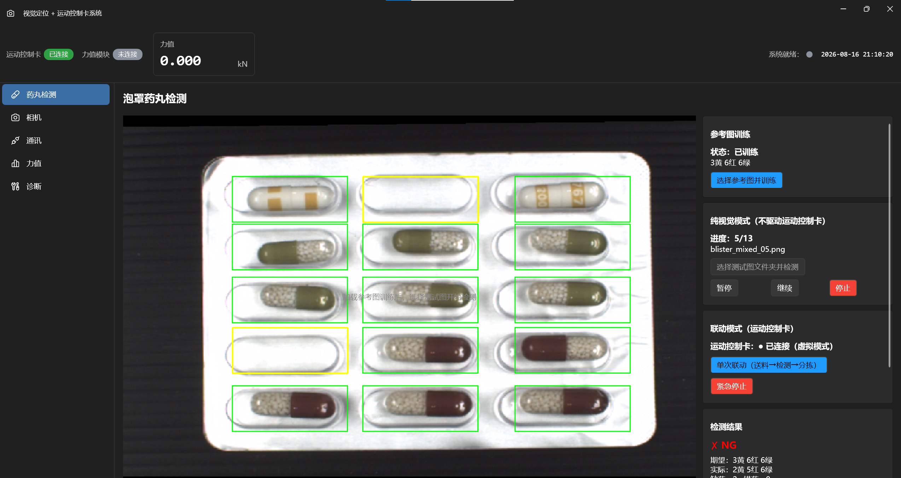
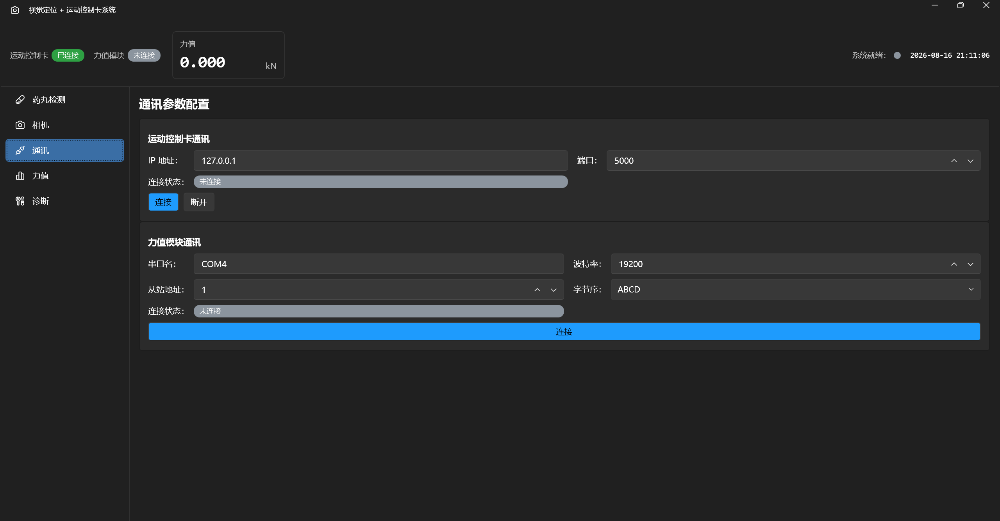

# BlisterPillInspection 泡罩药丸缺陷检测系统

> WPF .NET 8 上位机软件，基于 **HALCON GMM 分类器**实现泡罩药丸缺陷检测（缺药/错药），并用**固高 GTS 运动控制卡**做 3 轴送料/分拣闭环。
> 项目由 HDevelop 官方 `blister` 示例提炼算法，重构为完整 MVVM 上位机工程。

## 项目定位

- **个人独立开发项目，非工程落地项目**。
- 核心目标：产出代码工程质量过硬的完整实现。
- 严格考核三个维度：**线程安全、健壮性、可读性**。
- 相机使用 Stub 占位（大恒 Galaxy 接口已定义，未接真实硬件）；运动控制卡/力值模块未做硬件联调。
- 但接口和代码质量按工业级标准要求。

## 功能概览

- **泡罩药丸缺陷检测**：HALCON GMM 分类器识别缺药/错药
- **图像配准**：测试图自动对齐参考图（vector_angle_to_rigid）
- **3 轴编排**：传送带送料 → 检测 → NG/OK 拨杆分拣
- **结果可视化**：绿框=正确、红框=错药、黄框=缺药
- **力值模块**（可选保留）：500B 力值模块 Modbus RTU 直读
- **虚拟运动控制卡**：无真实硬件/模拟器时自动回退到内置虚拟 3 轴服务，联动流程开箱即用
- **批量检测控制**：暂停 / 继续 / 停止
- **换图立即生效**：更换参考图自动重训，下次检测立即用新模型
- **代码质量**：线程安全 T1-T6 / 健壮性 R1-R8 / 可读性 C1-C6

## 界面截图

<div align="center">

**泡罩药丸检测结果**（缺药叠加显示，黄框=缺药）



**通讯配置页面**



</div>

## 技术栈

| 层面 | 选型 |
|------|------|
| UI 框架 | WPF + .NET 8 + WPF-UI 4.0 |
| MVVM | CommunityToolkit.Mvvm 8.4（`[ObservableProperty]` / `[RelayCommand]`） |
| 依赖注入 | Microsoft.Extensions.Hosting（Generic Host） |
| 视觉算法 | **HALCON**（HalconDotNet + HSmartWindowControlWPF），GMM 分类器 |
| 相机 SDK | 大恒 Galaxy 通用 SDK（接口已定义，当前 Stub 实现） |
| 运动控制卡 | 固高 GTS 风格 TCP/JSON 协议（MotionShared 共享库，已并入本仓库） |
| 力值采集 | 500B 力值模块（独立 RS485 串口，自研 Modbus RTU） |
| 日志 | Serilog（结构化日志，控制台 + 文件 sink） |

## 泡罩检测原理

### 泡罩板布局

- **15 个格子**（5 行 × 3 列）
- **每行颜色固定**：第 1 行黄、第 2/3 行红、第 4/5 行绿
- **期望数量**：黄 3、红 6、绿 6 → `[3,6,6]`
- 药丸造型：黄药丸=中间两条竖矩形；红/绿=半颗有颜色、另一半是别的颜色

### 训练阶段（一次，用参考图）

```
参考图 → threshold(90,255) 提亮区（黄药丸被当药板区域）
      → select_shape(≥5000) 去噪声 → shape_trans(convex) 药板凸包
      → orientation_region + area_center 取配准基准（角度+中心）
      → gen_rectangle2 × 15 生成格子
      → 按行分黄/红/绿三类（select_shape 'row'）
      → 按颜色提取样本：
          黄 = threshold(B 通道, 60~95)          （黄药丸无黑，普通阈值）
          红 = invert(B) + hysteresis(190,200,5)（消除黑色干扰）
          绿 = invert(B) + hysteresis(180,200,10)
      → concat_obj 成 Classes（位置=类别：1黄/2红/3绿）
      → create_class_gmm(3特征, 3类) → add_samples_image_class_gmm → train_class_gmm
```

### 检测阶段（可反复，用测试图）

```
测试图 → 配准（vector_angle_to_rigid + affine_trans_image 对齐参考图）
      → reduce_domain(ChambersUnion) 裁剪 15 格区域
      → classify_image_class_gmm(0.0005) 逐像素分类
      → 逐类认领药丸格子（先绿→红→黄，因黄像素散、放最后避免面积过滤损失）
      → difference 从 15 格划掉已认领格子
      → LeftOvers 灰度偏差判定：>40 错药（红框）/ ≤40 缺药（黄框）
      → 数量统计 vs 期望 [3,6,6] → OK/NG
```

### 系统能力边界

| 情况 | 能否检测 | 方式 |
|------|---------|------|
| 缺药（格子空） | ✅ | 黄框（LeftOvers 灰度低） |
| 错药（非三类颜色，如蓝/黑药） | ✅ | 红框（GMM 筛不出） |
| 错药（颜色对但种类错，如该绿却红） | ❌ 框不出 | 靠数量文字提示（Detected≠Expected） |

GMM 只能识别黄/红/绿三类，三类之外的错药能框、三类之内的种类错位靠数量统计文字暴露。

## 目录结构

```
BlisterPillInspection/
├── Infrastructure/
│   ├── DI/ServiceCollectionExtensions.cs   # DI 注册
│   ├── Constants.cs                        # 全局常量（3 轴号/送料步进/拨杆行程/重连退避）
│   └── DispatcherHelper.cs                 # UI 线程调度（T1/T5）
├── Models/
│   ├── Camera/  ├── Communication/  ├── Force/  ├── Vision/
│   ├── Enums.cs  ├── InspectionResult.cs
├── Services/
│   ├── Interfaces/                          # IBlisterCheckService / IInspectionOrchestrator / IMotionCardService / ...
│   ├── Vision/BlisterCheckService.cs        # 泡罩检测核心（HALCON GMM 训练+检测）
│   ├── Orchestration/InspectionOrchestrator.cs  # 3 轴编排（送料→检测→分拣）
│   ├── MotionCard/GtsClient.cs + GtsMotionCardService.cs  # 固高 GTS TCP + 断线重连 + 指令串行化
│   ├── Force/ForceModule500BService.cs      # 500B 力值模块 Modbus RTU
│   ├── Communication/ModbusRtuTransport.cs  # CRC16 + 串口 + 重试退避
│   ├── Configuration/AppConfigService.cs    # JSON 配置
│   └── Camera/StubCameraService.cs          # 本地图片模拟相机
├── ViewModels/  ├── Pages/  ├── Views/  ├── Resources/
├── App.xaml(.cs)                            # Generic Host + 全局异常三件套
└── MainWindow.xaml(.cs)

src/MotionShared/                            # 固高 GTS TCP/JSON 协议共享库（已并入本仓库）
images/                                      # 泡罩检测测试图（参考图 + 12 张测试图）
BlisterPillCheck/                            # HDevelop 原型脚本 + 导出的 C#（算法参考）
docs/                                        # 界面截图（检测结果 / 通讯页面）
```

## 前置条件（构建必需）

1. **.NET 8 SDK**（`net8.0-windows`）
2. **Windows 10/11**（WPF 依赖）
3. **HALCON 24.11**（商业付费软件，MVTec）——需安装并配置环境变量 `HALCONROOT`
   - 程序集引用：`$(HALCONROOT)\bin\dotnet35\halcondotnet.dll`
   - 未安装 HALCON 则无法编译（视觉部分依赖 HalconDotNet）
4. 其余依赖（WPF-UI / CommunityToolkit.Mvvm / Serilog / ScottPlot 等）通过 NuGet 自动还原

> ⚠️ 本仓库**不包含** HALCON SDK 的 DLL——那是 MVTec 商业授权软件，需自行安装。

## 构建与运行

```powershell
# 构建（需先安装 HALCON 并配置 HALCONROOT）
dotnet build BlisterPillInspection.sln

# 运行
dotnet run --project BlisterPillInspection/BlisterPillInspection.csproj

# 或直接运行编译产物
.\BlisterPillInspection\bin\Debug\net8.0-windows\BlisterPillInspection.exe
```

> 应用启动时相机使用 Stub 占位（从 `images/` 模拟推送帧），UI 可正常加载与导航。运动控制卡服务默认连接 127.0.0.1:5000——**若没有真实控制卡或模拟器，启动时会自动回退到内置虚拟运动控制卡**（模拟 3 轴送料/分拣），联动模式开箱即用。

## 线程安全（T1-T6）

| 编号 | 要求 | 实现 |
|------|------|------|
| T1 | 跨线程改 VM 必须经 DispatcherHelper | 事件回调统一走 `DispatcherHelper.InvokeAsync` |
| T2 | 运动指令内部串行化 | `GtsMotionCardService._cmdLock`（SemaphoreSlim） |
| T3 | 标志位 volatile + Interlocked | `_client` / `_isReconnecting` |
| T5 | 事件跨线程触发保护 | async void 事件回调 try/catch 兜底 |
| T6 | 编排串行化 | `InspectionOrchestrator._runLock`（SemaphoreSlim(1,1)） |

## 健壮性（R1-R8）

| 编号 | 要求 | 实现 |
|------|------|------|
| R1 | 断线自动重连 | 退避序列 {1,2,5,10} 秒（运动卡 + 力值） |
| R2 | Modbus 超时 + 重试 + 指数退避 | `Constants.ModbusRetryCount` |
| R3 | CRC 校验失败丢弃 | `VerifyCrc` 失败 continue + 警告日志 |
| R5 | 配置文件损坏容错 | `optional=true` + 内存默认值 |
| R6 | 全局异常三件套 | `AppDomain` / `TaskScheduler` / `Dispatcher` |
| R7 | Halcon 非托管资源管理 | GMM 句柄/out 参数所有权转移 + 单一所有权防双重释放 |

## 关键设计决策

1. **GMM 分类器**：3 特征（RGB）、3 类（黄/红/绿），`normalization` 归一化，种子 42 保证可复现
2. **红/绿药丸用滞后阈值（hysteresis）**：药丸内有黑色部分，用 `invert(B)` + hysteresis 消除黑色干扰；黄药丸无黑故普通 `threshold`
3. **逐类认领格子（先绿→红→黄）**：绿/红像素集中干净先筛，黄像素分散放最后避免面积过滤损失
4. **Halcon 非托管资源管理（R7）**：GMM 句柄不能放 using 块（Bug：训练完被释放→检测空句柄→error #4056）；out 参数所有权转移；单一所有权防双重释放
5. **断线重连竞态防护**：`DisconnectAsync` 清空 IP 作"主动断开"信号，重连循环多重检查
6. **急停两层**：GT_EmergencyStop 硬件刹停 + 取消令牌逻辑中断

## 已知局限 / 待优化

- 格子坐标写死 + 依赖配准精度（只能保证参考图完全匹配）
- 配准无二次校验（配准失败会套偏格子）
- 期望数量 [3,6,6] 写死
- 相机真实采集未接（待接入大恒 Galaxy SDK）

## License

本项目源码部分采用 MIT License（见 `LICENSE`）。
HALCON 为 MVTec 商业软件，需自行购买许可。
